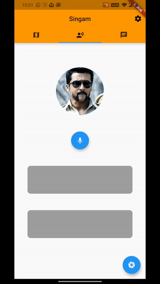

# Police_Surveillance_Assistant
A surveillance assistant for assisting the police functionalities


### Clone the Repository
```
git clone git@github.com:karthik540/Police_Survillence_Assistant.git
```

### Installing the dependencies
```
pip install -r requirements.txt
```

### Running the server
```
python main.py
```

### Installing the PSA app on your phone
- Navigate to **.\Police_Survillence_Assistant\Assets**
- Find **PSA.apk**
- **Install** it on your Android Device


